# OneDrivePlayer Documentation

## What's New in Version 1.0.23

- **`.m3u` and `.m3u8` playlist support**: You can now import either format.
- **Choose Music Folder**: Pick where downloaded tracks are stored (internal storage or SD card folder access).
- **Shuffle is now a player button on mobile**: Shuffle is no longer in the phone app menu.
- **Improved offline mode**: Faster offline startup and playlist switching for downloaded playlists, with a clear offline information banner.

## signing up to test the app before public release: 
please use [this link](https://play.google.com/apps/testing/com.hoegersoftware.onedriveplayer)

## Running the App
If you don't already have .m3u playlists files in your OneDrive account please see the instructions below

1. (Recommended) Set your download location first:
   - Open the app menu and select **Choose Music Folder**.
   - Pick the folder where music should be stored.
   - If you change this later, the app migrates your downloaded files to the new location.
2. Sign in to the app:
   - Click the menu in the upper right corner of the app and select "Sign in".
   - Sign in to your Microsoft Account.

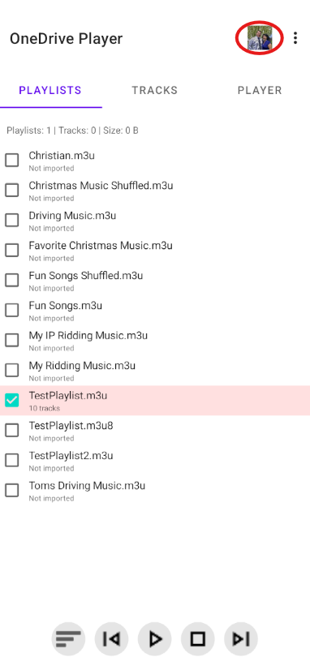

3. After signing in, you should see all your playlists listed. Select one of them.
4. The app will automatically select the checkbox to the left when you select a playlist and then download the files to your phone.
   - This may take a long time for large playlists, so test it out with a smaller one first.
   - You will see a popup that shows "loading  1 of 8" for instance.
   - You can select **Cancel** in the import dialog at any time if you want to stop the import.

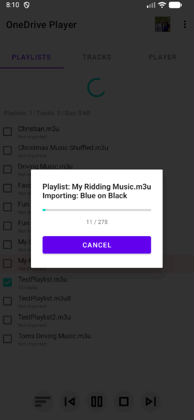

5. Once loaded, you will be moved to the "tracks" tab where you can select a song to play.

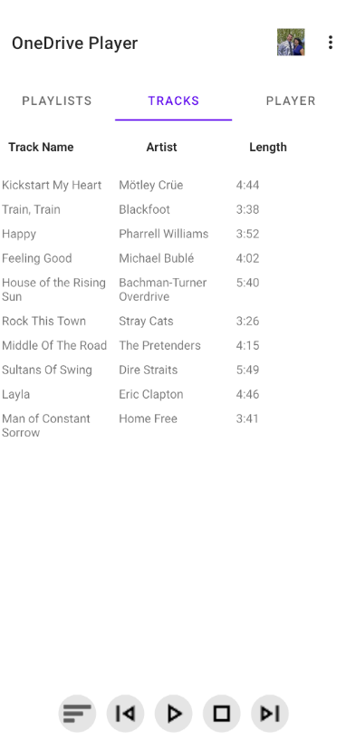

6. When you select a song, it will move you to the "Player" tab.

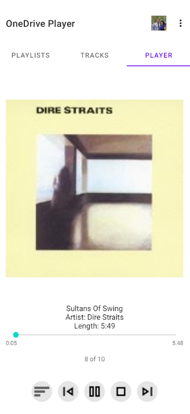

### Cancelling an import

- When you select **Cancel** in the import dialog, the button is disabled and the dialog shows **Cancelling import...**.
- The current import request is cancelled, and the playlist import stops.
- Tracks that were downloaded during that active import session are cleaned up automatically.
- Previously downloaded/cached tracks from earlier completed imports are kept.
- For normal playlist imports, the playlist checkbox is cleared so the playlist is not left in a partial imported state.
- For **Update Changed Playlists**, cancel stops the batch and shows the update summary for anything that already completed.

### Offline usage

- If your playlists are already downloaded, you can launch and use the app in airplane mode.
- The app shows an offline information banner so it is clear that downloaded music playback is active.
- You can switch between downloaded playlists and play local tracks without needing a network connection.
- If the network drops, the app stays offline until you manually sign in again from the menu.

Everything else should be pretty self-explanatory. If you need to clear up space, you can "uncheck" the checkbox next to a playlist, and it will delete the files from your phone for that playlist.  The app will prompt you to confirm before deleting the files.

## Android Auto screens
When plugged into Android Auto, the app will show up as "OneDrive Player" and you can select it to see your playlists and tracks. You can control play/pause and skip tracks from the Android Auto interface.

### Shuffle and track navigation behavior

- **Shuffle play** can be toggled from either:
  - the phone app **shuffle button** on the player controls, or
  - the Android Auto player shuffle button.
- Shuffle state is synchronized between phone and Android Auto.
- The Phone and Android Auto shuffle icon changes by state:
  - `rotate` icon when shuffle is enabled

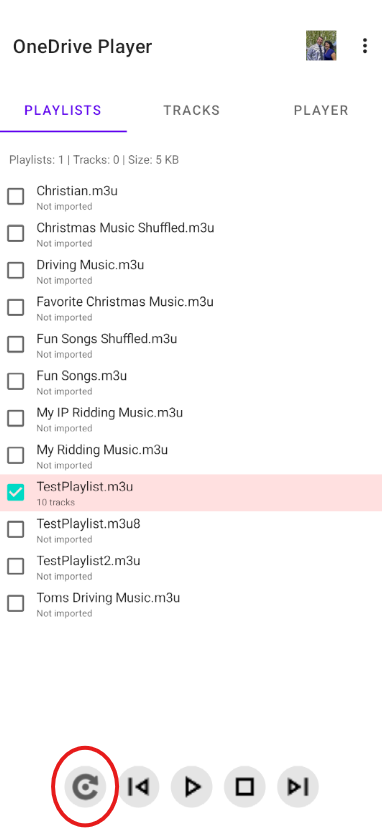

  - `sort` icon when shuffle is disabled

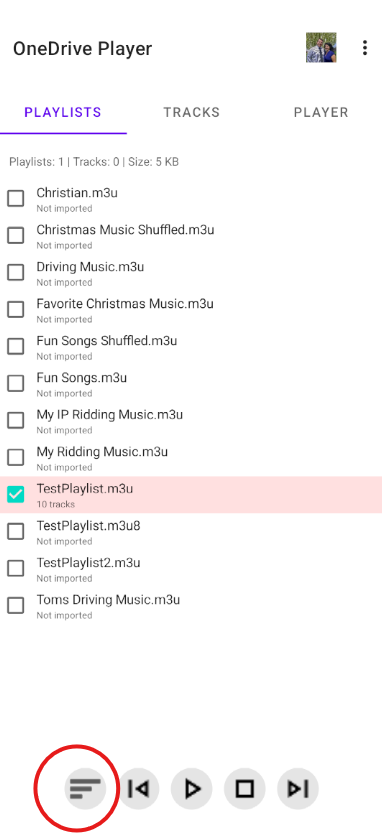

### Next / Previous at playlist boundaries

Track navigation now wraps at playlist boundaries on both phone and Android Auto:

- **Next** on the last track goes to the **first** track.
- **Previous** on the first track goes to the **last** track.

There are three screens in Android Auto:
1. The full screen
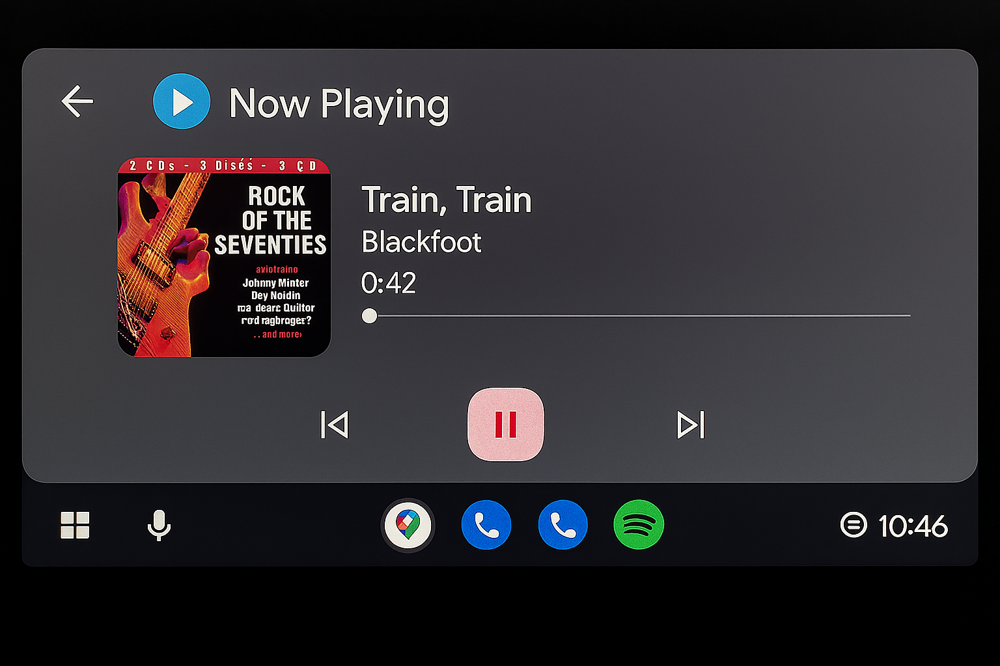
2. The half screen
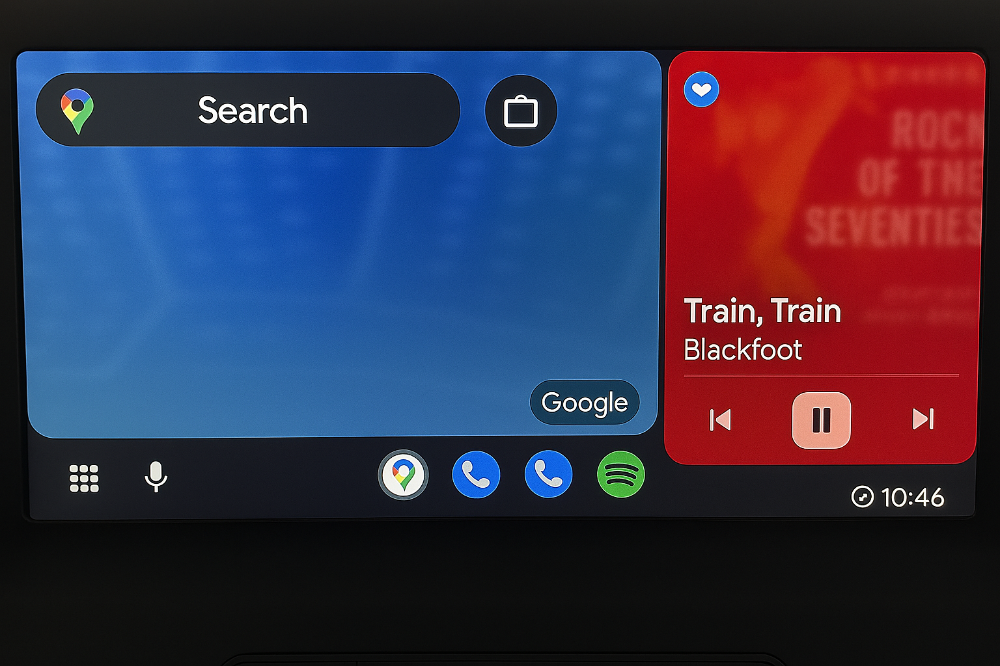
3. The minimized screen
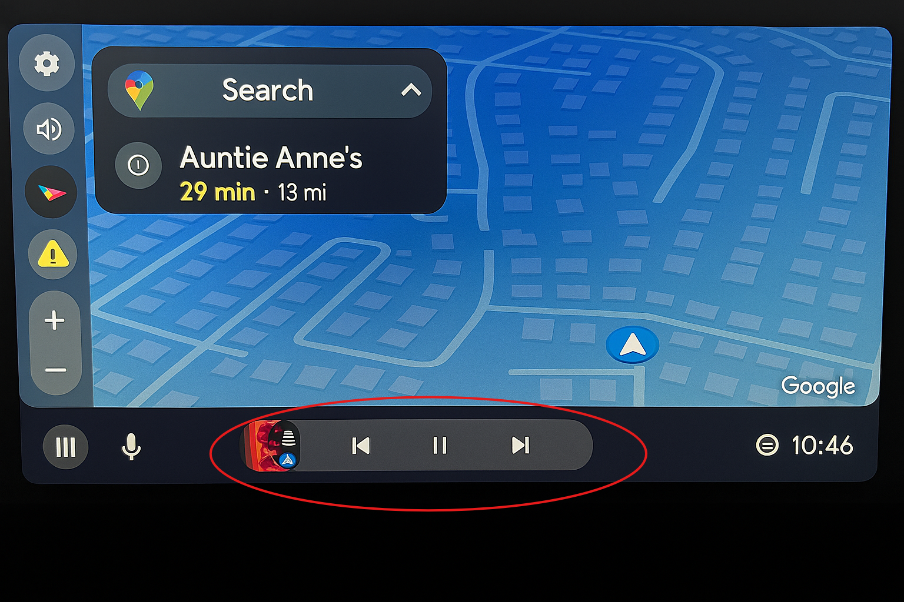

## Creating a Playlist

For best results, create an M3U playlist with Windows Media Player on your computer and save all your music files to your "Music" folder under your OneDrive folder. Then save the playlist to a "Playlists" folder under that Music folder. For example, my playlists are saved to `C:\\Users\\dan.hoeger\\OneDrive\\Music\\Playlists`.

The format of a `.m3u` or `.m3u8` file should look something like this:

```text
#EXTM3U

#EXTINF:284,Mötley Crüe - Kickstart My Heart
..\Mötley Crüe\Motley Crue Greatest Hits\04 Kickstart My Heart.mp3

#EXTINF:232,Pharrell Williams - Happy
..\Pharrell Williams\G I R L\05 Happy.mp3

#EXTINF:242,Michael Bublé - Feeling Good
..\Michael Bublé\It's Time\01 Feeling Good.mp3

#EXTINF:340,Bachman-Turner Overdrive - House of the Rising Sun
..\Bachman-Turner Overdrive\Greatest & Latest\01 House of the Rising Sun.mp3

#EXTINF:206,Stray Cats - Rock This Town
..\Various Artists\Guitar Rock Early '80s\02 Rock This Town.mp3

```

This format follows the standard M3U format, which is supported by Windows Media Player. The `#EXTM3U` line indicates that this is an extended M3U file, and each song entry consists of an `#EXTINF` line (formated as: `#EXTINF:{length in seconds},{title}-{artist}`) followed on the next line by the relative path to the music file.  
Be careful to use relative paths to the music files as shown in the example above, otherwise the app won't be able to find the files when it tries to download them to your phone.
Also, if you have special characters in your file paths, such as `é`, `ö` or `ü`, etc., make sure your files is saved with UTF-8 encoding, otherwise the app may not be able to read the file paths correctly and won't be able to find the files to download them to your phone. (most text editors will save in UTF-8 by default, but just be sure to check if you have special characters in your file paths). Using `.m3u8` is a good option when you want to explicitly use UTF-8.
For more information on the M3U format see [this Wikipedia article](https://en.wikipedia.org/wiki/M3U).

## Steps to Create a Playlist with Windows Media Player for Windows
Note: if you don't have Windows Media Player installed, you can install it from the Microsoft Store for free or you can follow the instructions here: https://www.intowindows.com/how-to-install-windows-media-player-in-windows-10-11

1. Move all your music to the Music folder in your OneDrive.
2. Run Windows Media Player and ensure that the Music folder is added to your Library.
   - Click on "Organize" then select "Manage Libraries" -&gt; "Music" and make sure your OneDrive\\Music folder is added there.
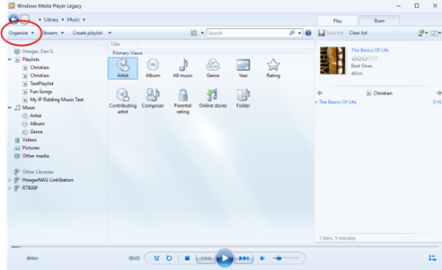
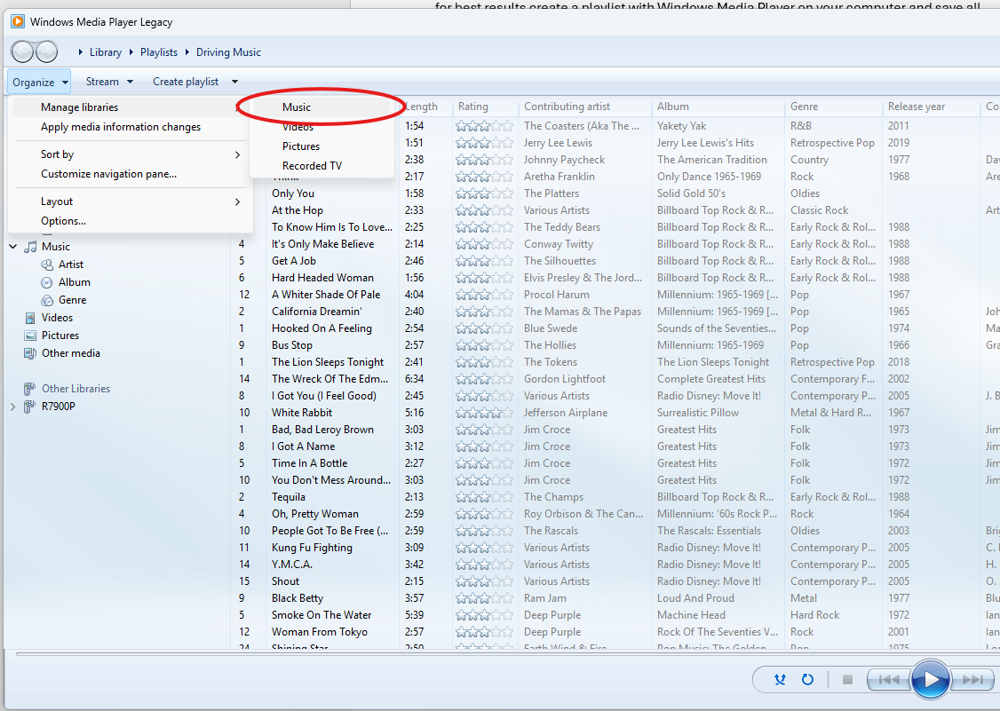
3. Once all the files have been loaded in Windows Media Player, select the "Play" tab at the top right.
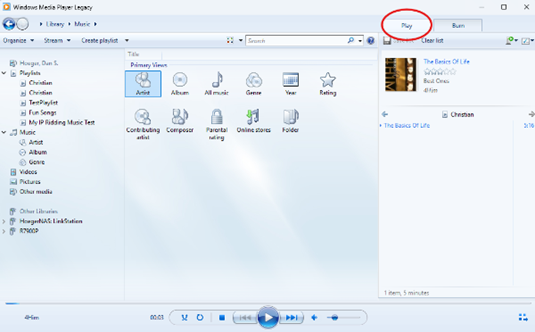
4. Select the songs you want for the playlist and copy them to the window on the right side of the app.
5. When you have the list the way you want it, click the "playlist" button on the upper right and select "save list as...".
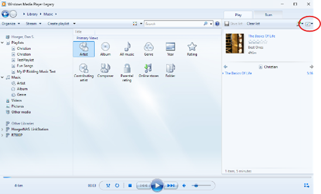
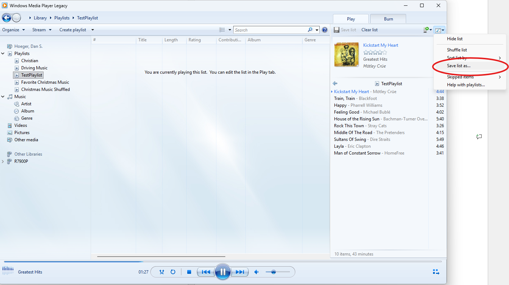
6. Change the type to "*.m3u", give it a name, and select "save". If your editor supports it, you can also save as `*.m3u8` with UTF-8 encoding.
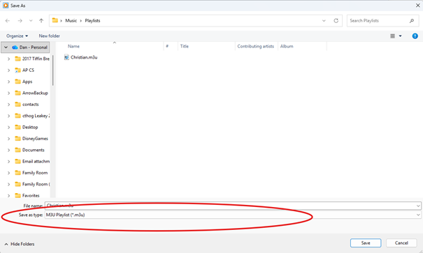

Note: If you have a large playlist, it may take a while for the app to download all the files to your phone, so you may want to start with a smaller playlist to test it out first.

Note: Windows Media Player by default saves M3U files with only the filename on the #EXTINF line, so you may want to edit the M3U file in a text editor to include the artist and title in the #EXTINF line as shown in the example above, otherwise the app will just show the filename without the artist and title information.
I've created a PowerShell script called [Update-M3U.ps1](Scripts/Update-M3U.ps1) that can automate this process of updating the #EXTINF lines with the correct metadata extracted from the audio files, so you don't have to do it manually. You can find instructions on how to use that script in the [Scripts/README-Update-M3U.md](Scripts/README-Update-M3U.md) file.
